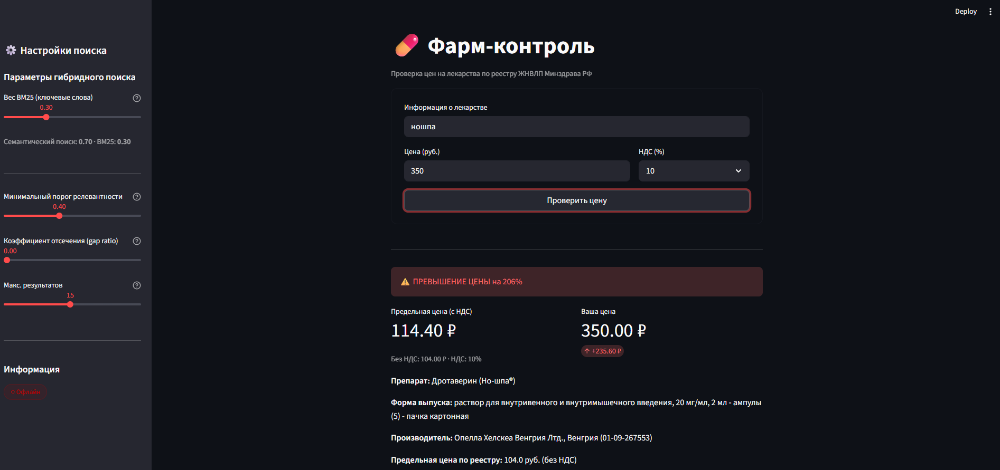
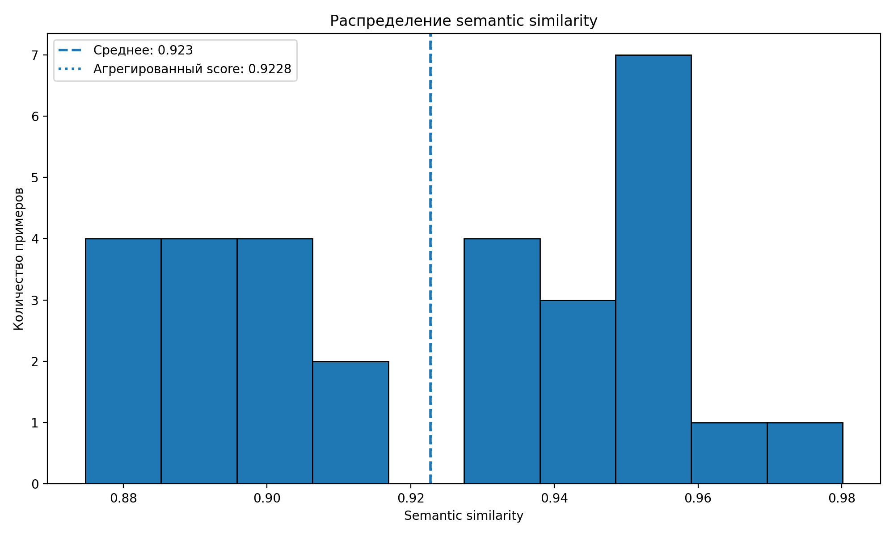
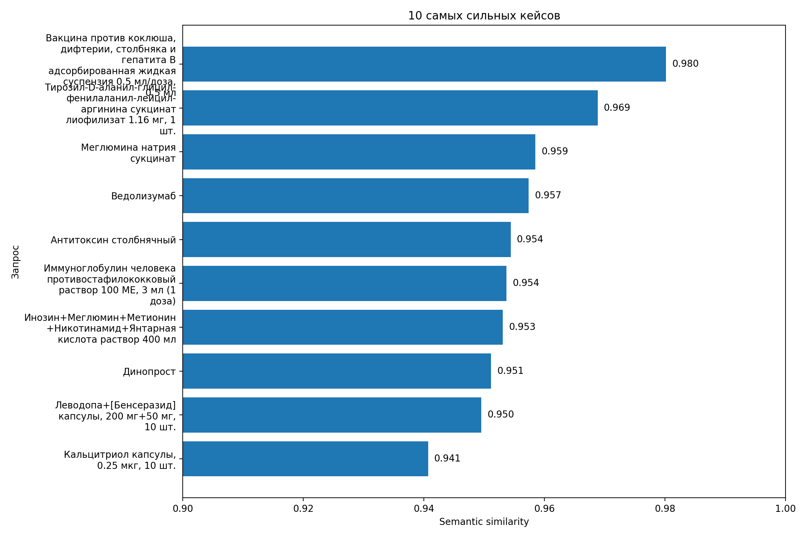
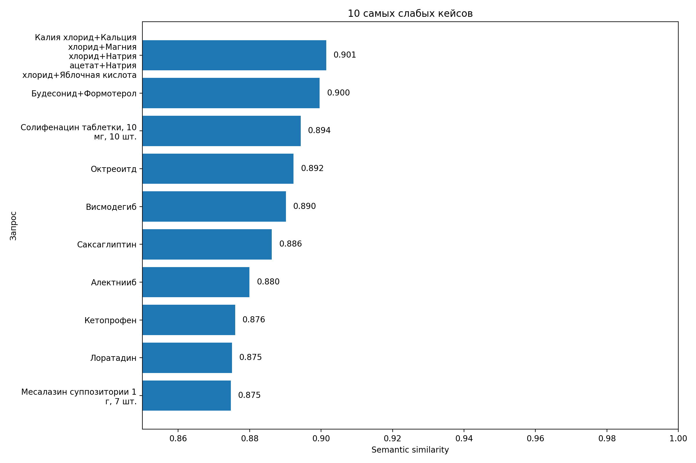

# 💊🫸 ФармКонтроль
Команда №62
> Сервис проверки цен на лекарства из перечня ЖНВЛП.
---

## О проекте

**ФармКонтроль** — это веб-сервис, который помогает гражданам проверять, не завышает ли аптека цену на жизненно необходимые лекарственные препараты (ЖНВЛП). 

Пользователь вводит название препарата и цену с ценника аптеки. Система сверяет данные с официальным реестром предельных отпускных цен Минздрава РФ и мгновенно сообщает о возможном нарушении.

### Ключевые возможности

- **Семантический поиск** — понимает разговорные названия и синонимы препаратов
- **Мгновенная проверка** — сравнение с официальным реестром за секунды
- **Детальный отчёт** — номер постановления, дата регистрации цены, процент превышения
- **Простой интерфейс** — минимум действий для получения результата

## Пример работы



Презентацию к проекту можно найти [ЗДЕСЬ](docs/slides_team62_farmcontrol.pdf).

## Схематический принцип работы

```
┌─────────────────────────────────────────────────────────────────┐
│  Пользователь вводит: "аспирин кардио 100мг" + цена 350 руб.   │
└─────────────────────────────────────────────────────────────────┘
                              ↓
┌─────────────────────────────────────────────────────────────────┐
│  Векторный поиск находит в реестре:                             │
│  "Ацетилсалициловая кислота таб. п/о 100мг" — макс. 120 руб.   │
└─────────────────────────────────────────────────────────────────┘
                              ↓
┌─────────────────────────────────────────────────────────────────┐
│  ⚠️ ПРЕВЫШЕНИЕ ЦЕНЫ на 191%                                     │
│  Предельная цена: 120 руб. | Ваша цена: 350 руб.               │
│  Постановление №ХХХХ от ХХ.ХХ.2024                              │
└─────────────────────────────────────────────────────────────────┘
```

## Стек технологий

| Компонента | Технология | Назначение |
|-----------|------------|------------|
| **Backend** | Python 3.10+ | Основной язык разработки |
| **Интерфейс** | Streamlit | Веб-интерфейс пользователя |
| **Векторная БД** | FAISS(решено) | Хранение эмбеддингов препаратов |
| **Данные** | Pandas, openpyxl | Обработка Excel с реестром цен |
| **LLM/vLLM (опционально)** | Ollama | Генерация человекочитаемых ответов |

## Структура проекта

```
farmcontrol/
├── data/
│   ├── medicines.xlsx        # Реестр ЖНВЛП Минздрава РФ
│   ├── faiss_index.bin       # Генерируется через engine.py
│   ├── bm25_index.pkl        # Генерируется через engine.py
│   ├── metadata.pkl          # Генерируется через engine.py
│   └── corpus_tokenized.pkl  # Генерируется через engine.py
├── models/                   # Кеш SentenceTransformer (скачивается автоматически)
├── venv_faiss/               # Виртуальное окружение Python 3.10
├── engine.py                 # Построение индексов
├── testing.py                # Тестовые поисковые запросы
└── app.py                    # Streamlit-приложение
```


## Установка и запуск
[INSTRUCTION.md](docs/INSTRUCTION.md) — результаты тестирования

#### Быстрый старт (все команды разом)

```bash
source venv_faiss/bin/activate
pip install streamlit requests   # один раз
python3.10 engine.py                 # один раз
streamlit run app.py
```

## Источник данных

Данные получены из официального реестра предельных отпускных цен Минздрава РФ:

🔗 **https://grls.rosminzdrav.ru/PriceLims.aspx**

Реестр содержит информацию о предельных отпускных ценах производителей на лекарственные препараты, включённые в перечень ЖНВЛП (жизненно необходимые и важнейшие лекарственные препараты).

---

## План работ

| Этап | Описание | Дедлайн | Статус |
|------|----------|---------|--------|
| 1 | Обзор литературы и аналогов → `REFERENCES.md` | 02.03.2026 | ✅ |
| 2 | Анализ целевой аудитории → `ANALYSIS.md` | 05.03.2026 | ✅ (частично в TESTS.md)|
| 3 | Baseline-решение с минимальным функционалом | 10.03.2026 | ✅|
| 4 | Тестирование (техническое + фокус-группа) → `TESTS.md` | 12.03.2026 | ✅(RAGAS + фидбек фокус-групп в TESTS.md) |
| 5 | Улучшения по результатам фидбека → `IMPROVEMENTS.md` | 16.03.2026 | ✅(Использование Qwen по API вместо Llama) |
| 6 | Запись скринкаста демонстрации | 17.03.2026 | ⏳ |

### Распределение задач в команде

| Участник | Зона ответственности |
|----------|---------------------|
| Роман П. | Управление проектом, подготовка данных, векторная БД, Streamlit (UI/UX) |
| Фёдор К. | RAG, подключение LLM, сбор метрик |
| Егор К. | Документация, аналитика данных, тестирование |


## Тестирование и дальнейшее развитие

### Метрики
Для их получения использовался фреймворк *RAGAS*. Производилась оценка семантической схожести с метадатой (международное наименование + форма и возможно + торговое наименование).
| Метрика | Значение |
|---------------------|--------------------------|
| Средний semantic similarity  |  0.9228 |
| Минимум  |  0.8747 |
| Медиана  |  0.9317 |
| Максимум  |  0.9801 |
| Стандартное отклонение  |  0.0313 |

Вы можете запустить тесты, согласно [инструкции](docs/INSTRUCTION.md). 

### Анализ потребителя (SWOT + Customer Journey Map)

Вы можете подробно почитать об этом [здесь](docs/TESTS.md).

### Улучшения, принятые после тестирования
> TLDR: Переход с локальной Llama на Qwen2.5 по API + улушение UI.

Вы можете подробно почитать об этом [здесь](docs/IMPROVEMENTS.md).

### Визуализация метрик

<div align="center">
  
</div>

<div align="center" style="display:flex; justify-content:center; gap:20px;">
  
  
</div>

### Примеры тестовых запросов

| Запрос пользователя | Ожидаемый матч в реестре |
|---------------------|--------------------------|
| "аспирин" | Ацетилсалициловая кислота ✅|
| "нурофен детский" | Ибупрофен ✅|
| "но-шпа" | Дротаверин ✅|
| "амоксиклав 500" | Амоксициллин + Клавулановая кислота ✅|

## Ограничения и дисклеймер

Сервис носит информационный характер и не является официальным инструментом контроля цен.

- Реестр содержит только препараты из перечня ЖНВЛП
- Предельная цена — это цена производителя, розничная цена может включать оптовую и розничную надбавки (регулируются регионально)
- Данные требуют периодического обновления
- !Уточните налогообложение аптеки, налоговая ставка регулируется в интерфейсе, но по умолчанию считается максимальной (22% на 2026 год).

## Документация
- [REFERENCES.md](docs/REFERENCES.md) — обзор аналогов и научных работ
- [ANALYSIS.md](docs/ANALYSIS.md) — анализ целевой аудитории
- [TESTS.md](docs/TESTS.md) — результаты тестирования
- [IMPROVEMENTS.md](docs/IMPROVEMENTS.md) — внедрённые улучшения


## Лицензия

GNU GPLv3. Подробности в файле [LICENSE](LICENSE).
